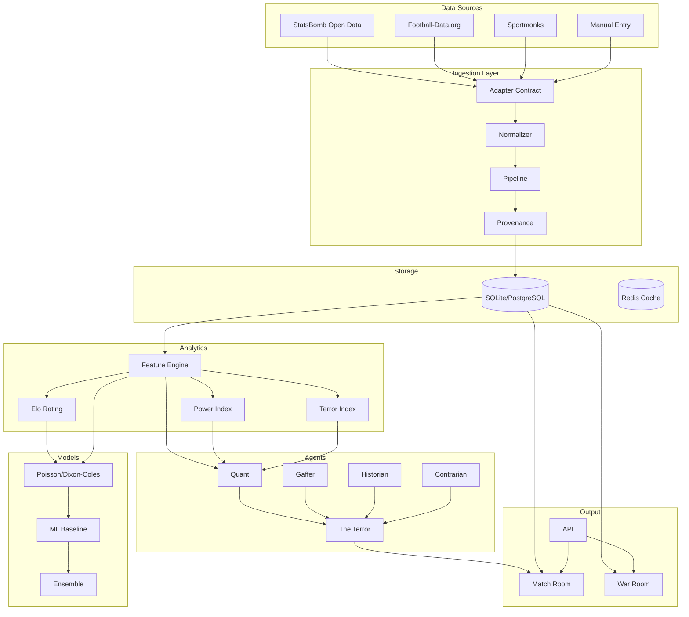

# FootballTerror — Architecture

## Monorepo Structure

```
footballterror/
├── apps/                    # User-facing applications
│   ├── web/                 # Next.js frontend
│   ├── api/                 # REST/tRPC API
│   └── worker/              # Background job processor
├── packages/                # Shared libraries
│   ├── football-schema/     # Canonical domain types (TypeScript)
│   ├── database/            # Drizzle ORM, migrations
│   ├── config/              # Environment configuration
│   ├── logger/              # Structured logging (pino)
│   ├── shared/              # Shared utilities
│   └── ui/                  # Shared UI components
├── services/                # Domain services
│   ├── ingestion/           # Data adapter + normalization + pipeline
│   ├── analytics/           # Feature engineering (Phase 2)
│   ├── forecasting/         # TimesFM integration (Phase 4)
│   └── agents/              # Agent orchestration (Phase 5)
├── agents/                  # Agent definitions (Phase 5)
├── models/                  # Prediction models (Phase 3)
├── docs/                    # Documentation
├── tests/                   # Cross-cutting test fixtures
└── infra/                   # Infrastructure config
```

## System Architecture



## Data Flow

1. **Ingestion**: Adapter fetches raw data → Normalizer converts to canonical types → Pipeline stores with provenance
2. **Analytics**: Feature Engine computes rolling features from normalized data
3. **Models**: Prediction models consume features, produce probabilities
4. **Agents**: Specialist agents receive structured evidence, produce claims
5. **Synthesis**: The Terror agent receives all agent outputs, produces verdict
6. **Output**: Match Room, War Room, API serve intelligence to users

## Technology Stack

| Layer | Technology |
|-------|-----------|
| Frontend | Next.js, React, TypeScript |
| API | Express/Node.js |
| Worker | Node.js + custom job queue |
| Database | SQLite (dev) / PostgreSQL (prod) |
| ORM | Drizzle |
| Cache | Redis (optional) |
| Logging | pino |
| Monorepo | pnpm workspaces + Turborepo |
| Testing | Vitest |
| Language | TypeScript (apps, services), Python (models, ML) |

## Key Design Decisions

1. **Provider-neutral adapters**: No downstream code depends on provider-specific fields
2. **Immutable predictions**: Every prediction is a new snapshot, never overwritten
3. **Provenance tracking**: Every ingested object retains its source lineage
4. **Event-driven**: Services subscribe to domain events, not poll
5. **SQLite-first**: Fast local development, PostgreSQL-ready schema
6. **Deterministic > LLM**: All numerical computation uses code, LLMs only for reasoning
