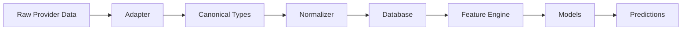

# FootballTerror — Data Model

## Canonical Entity Types

All data in FootballTerror uses canonical types defined in `packages/football-schema`. Data providers map their formats to these types through adapters.

## Core Entities

### Competition
- `id`: FT internal ID
- `name`, `country`, `confederation`, `level`
- Source: provider-specific

### Season
- `id`, `competitionId`, `name` (e.g. "2023/24")
- `startDate`, `endDate`, `active`

### Club
- `id`, `name`, `shortName`, `country`, `city`, `venue`
- `crestUrl`, `primaryColor`, `secondaryColor`

### Player
- `id`, `name`, `firstName`, `lastName`
- `dateOfBirth`, `nationality`, `position`, `foot`
- `currentClubId`

### Fixture
- `id`, `competitionId`, `seasonId`, `matchday`
- `status` (scheduled/in_play/halftime/finished/postponed/cancelled/awarded)
- `utcKickoff`, `venue`, `referee`, `attendance`
- `homeTeamId`, `awayTeamId`, `homeScore`, `awayScore`
- `slug` (URL-friendly identifier)

### MatchEvent
- Granular per-event data (goals, shots, passes, fouls, cards, etc.)
- `minute`, `second`, `type`, `teamSide`, `playerId`
- `location` (pitch coordinates)

### TeamMatchStats / PlayerMatchStats
- Aggregated statistics per fixture
- Covers: shooting, possession, passing, defensive, discipline, advanced

## Prediction Entities

### MatchPrediction
- Immutable — every version is a new snapshot
- `homeWinProbability`, `drawProbability`, `awayWinProbability`
- `expectedHomeGoals`, `expectedAwayGoals`
- `scoreProbabilities` (score grid)
- `confidence`, `entropy`, `inputHash`
- `actualHomeGoals`, `actualAwayGoals` (post-match)
- `evaluation` (post-match metrics)

### PowerIndexSnapshot
- `totalScore` (0-100)
- `components`: attack, defence, control, transition, form, squad, momentum, forecast
- `direction`, `changeFromPrevious`

### TerrorIndexSnapshot
- `totalScore` (0-100)
- `level`: dormant, watchable, heated, dangerous, terror, total_war
- `components`: rivalry, importance, scoring intensity, etc.

## Agent Entities

### AgentRun
- `agentType`, `status`, `modelVersion`
- `tokenUsage` (cost tracking)

### AgentObservation
- Structured claims with `evidenceType` (FACT/MODEL_OUTPUT/FORECAST/INFERENCE/OPINION/UNKNOWN)
- `confidence`, `supportingData`, `contradictingData`

### AgentClaim
- Synthesized claims with provenance chain

## Provenance

Every important object carries:
- `provider`: source provider ID
- `providerId`: provider's identifier
- `retrievedAt`: when we fetched it
- `rawPayloadHash`: SHA-256 of original data
- `normalizedVersion`: schema version
- `ingestionVersion`: pipeline version

## Data Flow

